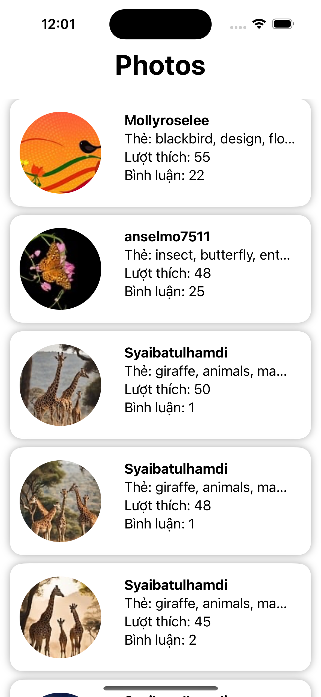

## 🚀 Project using Clean Architecture recommend by Google Developer

This guide encompasses best practices and recommended architecture for building robust, high-quality
apps

- [Guide to app architecture (Gooogle Developers)](https://developer.android.com/topic/architecture?continue=https%3A%2F%2Fdeveloper.android.com%2Fcourses%2Fpathways%2Fandroid-architecture%3Fhl%3Dvi%23article-https%3A%2F%2Fdeveloper.android.com%2Ftopic%2Farchitecture)

## 🚀 Introduction

This sample demonstrates how one can

- Setup base architecture of KMM (Kotlin Multiplatform Mobile) app using Clean Architecture
- Use Koin(dependency injection) for layers separation
- Make api calls using Ktor plugin.

```
├── androidApp
|   ├── di
|   └── presentation/features
├── iosApp
|   └── iosApp
|       └── Presentation
└── shared
    ├── androidMain
    |   ├── db
    |   └── BaseViewModel.kt
    ├── commonMain
    |   ├── kotlin
    |   |   ├── common
    |   |   ├── db
    |   |   ├── di
    |   |   ├── photo
    |   |   └── BaseViewModel.kt
    |   └── sqldelight
    |       └── ForestDatabase.sq
    └── iosMain
        ├── db
        └── di
```

#### Dependencies
- [Kotlinx Coroutines Core](https://mvnrepository.com/artifact/org.jetbrains.kotlinx/kotlinx-coroutines-core) :
  Library support for Kotlin coroutines with multiplatform support.
- [Lifecycle ViewModel Kotlin Extensions](https://mvnrepository.com/artifact/androidx.lifecycle/lifecycle-viewmodel-ktx) :
  Kotlin extensions for 'viewmodel' artifact
- [SqlDelight](https://github.com/cashapp/sqldelight/) : SQLDelight generates typesafe Kotlin APIs from
  your SQL statements. It verifies your schema, statements, and migrations at compile-time and provides
  IDE features like autocomplete and refactoring which make writing and maintaining SQL simple.
- [Koin](https://mvnrepository.com/artifact/io.insert-koin/koin-androidx-compose) : KOIN - Kotlin simple
  Dependency Injection Framework
- [Ktor](https://mvnrepository.com/artifact/io.ktor/ktor-client-core) : Ktor is a framework for quickly
  creating web applications in Kotlin with minimal effort.
- [Coil_Compose](https://mvnrepository.com/artifact/io.coil-kt/coil-compose) : An image loading library for
  Android backed by Kotlin Coroutines.

## 🚀 Module Structure


There are 3 main modules to help separate the code. They are Data, Domain, and Presentaion.

- **Data** contains Local Storage, APIs, Data objects (Request/Response object, DB objects), and the
  repository implementation.

- **Domain** contains UseCases, Domain Objects/Models, and Repository Interfaces

- **Presentaion** contains UI, View Objects, Widgets, etc. Can be split into separate modules itself
  if needed. For example, we could have a module called Device handling things like camera,
  location, etc.

### Presentation (View)

- View,updates UI

## 🚀 Screenshoots

|       Image        |                           |
|:------------------:|:-------------------------:|
|  |                           | 
