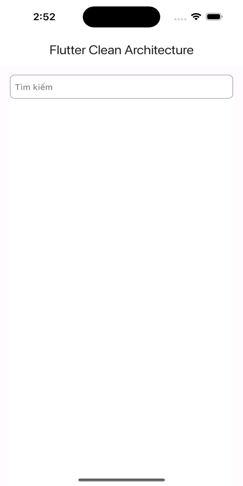
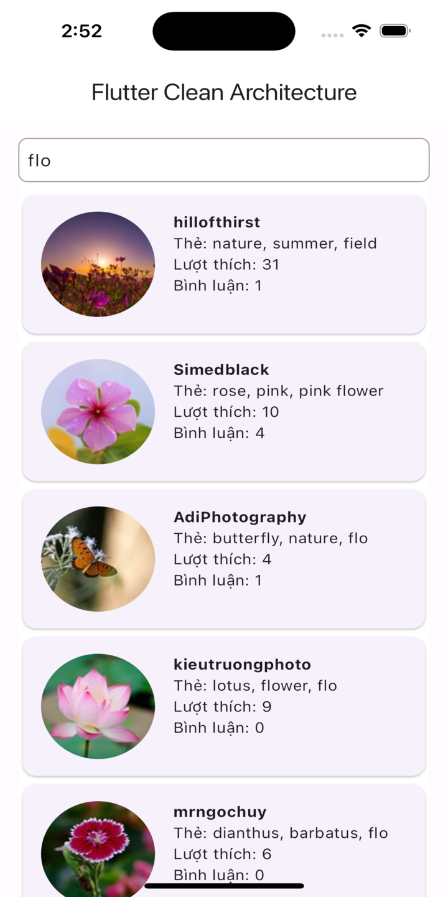

## 🚀 Project using Clean Architecture recommend by Google Developer

This guide encompasses best practices and recommended architecture for building robust, high-quality
apps

- [Guide to app architecture (Gooogle Developers)](https://developer.android.com/topic/architecture?continue=https%3A%2F%2Fdeveloper.android.com%2Fcourses%2Fpathways%2Fandroid-architecture%3Fhl%3Dvi%23article-https%3A%2F%2Fdeveloper.android.com%2Ftopic%2Farchitecture)

## 🚀 Introduction

This sample demonstrates how one can

- Setup base architecture of Flutter app using Clean Architecture
- Use dependency injection for layers separation
- Make api calls using Axios plugin.

```
├── androidApp
|   ├── di
|   └── presentation/features
├── iosApp
|   └── iosApp
|       └── Presentation
└── shared
    ├── androidMain
    |   ├── db
    |   └── BaseViewModel.kt
    ├── commonMain
    |   ├── kotlin
    |   |   ├── common
    |   |   ├── db
    |   |   ├── di
    |   |   ├── photo
    |   |   └── BaseViewModel.kt
    |   └── sqldelight
    |       └── ForestDatabase.sq
    └── iosMain
        ├── db
        └── di
```

#### Dependencies

- [Dio](https://pub.dev/packages/dio) : http client
- [Get_it](https://pub.dev/packages/get_it) : dependency injection
- [Build runner](https://pub.dev/packages/build_runner) : The build_runner package provides a
  concrete way of generating files using Dart code. Files are always generated directly on disk, and
  rebuilds are incremental - inspired by tools such as Bazel
- [Rxdart](https://pub.dev/packages/rxdart) : RxDart extends the capabilities of Dart Streams and
  StreamControllers.
- [Dartz](https://pub.dev/packages/dartz) : Functional programming in Dart.

## 🚀 Module Structure


There are 3 main modules to help separate the code. They are Data, Domain, and Presentaion.

- **Data** contains Local Storage, APIs, Data objects (Request/Response object, DB objects), and the
  repository implementation.

- **Domain** contains UseCases, Domain Objects/Models, and Repository Interfaces

- **Presentaion** contains UI, View Objects, Widgets, etc. Can be split into separate modules itself
  if needed. For example, we could have a module called Device handling things like camera,
  location, etc.

### Presentation (View)

- View,updates UI

## 🚀 Screenshoots

|               Default Search               |          Search keyword (ex: flo)          |
|:------------------------------------------:|:------------------------------------------:|
|                         |                         |
